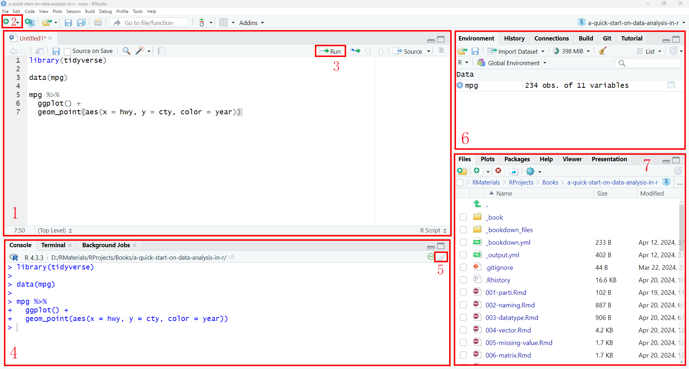
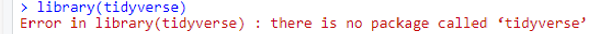

--- 
title: "体育科学数据分析:R语言实践"
author: "Lingxiao HE"
date: "`r Sys.Date()`"
site: bookdown::bookdown_site
documentclass: book
bibliography: [book.bib, packages.bib]
csl: journal-of-the-american-heart-association.csl # apa.csl is the citation style file
url: https://bookdown.org/lhe/data-analysis-in-sport-science-using-r/
cover-image: "./img/cover.png"
description: |
  This is a textbook for data analysis in sport science using R.
link-citations: yes
github-repo: ExerageLab/DataAnalysisInSportScienceUsingR
---

# 前言 {-}
## 软件安装 {-}
- 在开始学习前，我们需要先安装R与RStudio：
  1. [R下载链接](https://cran.r-project.org/mirrors.html)：点击任意站点，进入后，选择下载与操作系统匹配的R软件。
  
  
  R是进行数据分析的软件，但是它界面不够友好，因此我们通常使用RStudio来编写R代码。RStudio是一个集成开发环境（IDE），它提供了更加友好的界面，使得我们可以更加方便地进行编写代码、查看数据、绘制图表等工作。
  
  2. [RStudio下载链接](https://posit.co/download/rstudio-desktop/) 

***注意***：
<li>编写R代码时，所有的代码符号均为英文标点符号。</li>
<li>`#`是R中的注释符（快捷键为`Shift`+`Ctrl`+`c`），运行时不会执行`#`这一行的代码，通常被用作<u>代码注释</u>或者<u>特定代码的测试</u>。</li>
<li>在控制台（Console）输入 `?`+函数 可以获取函数的详细介绍。</li>

## RStudio界面 {-}

打开RStudio，我们通常会看到如上图所示的界面。

界面1为脚本界面，我们将在这里写代码。如果这个界面没有出现，可以点击左上角<font color="red">2</font>按键，选择`R Script`（快捷键为`Ctrl`+`Shift`+`n`）创建。在脚本界面中，如果我们想要运行特定一行的代码，可以把光标放在<u>该行代码的任意位置</u>，然后按右侧的`Run`<font color="red">3</font>按键（快捷键为`Ctrl`+`Enter`）。如果要运行多行代码，则需要先用鼠标选中所有要运行的代码，然后再按`Run`按键。

界面4为控制台界面，代码运行的结果或者提示信息将会在这里显示。如果想运行单行指令，也可以在这里快速输入。注意，每次回车后，该行指令将被运行。当界面中信息过多时，可以点击右上角的扫帚符号<font color="red">5</font>进行清空。

界面6为数据展示界面，它展示当前载入或生成的数据等信息。当需要查看数据时，可以点击对应的数据名称，这时在界面1中会显示该数据的内容。此外，在界面4中输入对应的数据名称时，也可以显示数据内容。

界面7的`Files`选项卡显示当前工作路径下的文件。当利用R作图时，`Plots`选项卡将显示图像。`Pakcages`选项卡显示已安装的R包，我们可以在其中查找和选择特定的包并进行升级。

## R包的安装 {-}
R之所以广受欢迎，很大一个原因就是它拥有种类繁多的“包”以满足我们的多种需求。尽管R自带一些功能强大的“包”，但是我们在需要的时候还得额外安装“包”，否则，调用包就会报错。

这时就需要用到`install.packages()`函数。例如，当我们需要安装***tidyverse***包时，可以输入`install.packages("tidyverse")`。


## R包的调用 {-}
我们如果需要使用某一个“包”，则需要在开始时使用`library()`函数调用它。例如，我们在安装完***tidyverse***包后，调用它时可以输入 `library(tidyverse)`。

有时我们会在一个项目中调用多个包，而有些包里的函数会出现**重名**的情况，这时，后调用的“包”将覆盖先前加载“包”的功能。如果我们需要使用特定包的某个重名函数，可以输入`包::函数`。例如***tseries***和***chron***包都含有`is.weekend()`函数，如果要调用***chron***包的`is.weekend()`函数，则可以写成`chron::is.weekend()`。

当我们不清楚某个“包”是否有安装，可以使用`if (!require(包)){install.packages("包")}`，这个代码的含义是，检查特定的包是否存在，如果不存在，将安装它。比如，检查***tidyverse***包是否存在，如果不存在则安装它，可以写成 `if (!require(tidyverse)){install.packages("tidyverse")}`

```{r include=FALSE}
# automatically create a bib database for R packages
knitr::write_bib(c(
  .packages(), 'bookdown', 'knitr', 'rmarkdown'
), 'packages.bib')
```
